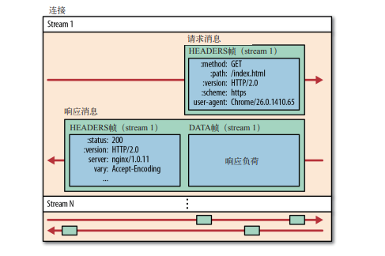

# HTTP 2.0
## 0x00 Summary
## 0x01 History
## 0x02 Feature
### Binary Framing Layer
二进制分帧层 
> HTTP 2.0性能增强的核心

二进制分帧层定义了如何封装HTTP Message并在客户端和服务端直接传输。

二进制分帧层的分层是指封装了传输的编码方式：HTTP 1.x 以换行符作为纯文本的分隔符，而 HTTP  2.0 将所有传输的信息分割为更小的消息和帧，并对它们采用二进制格式的编码。HTTP 的语义，包括各种动词、方法、首部，都不受影响。

### Streams, Messages, and Frames

流、消息和帧

* 流

  已建立的链接上的双向字节流。

* 消息

  与逻辑消息对应的完整的一系列数据帧。

* 帧

  HTTP 2.0 通信的最小单元，每个帧包含首部，至少也会表示出当前帧所属的流。

所有HTTP 2.0 通信都在一个连接上完成，这个连接可以承载任意数量的双向流。相应的，每个数据流以消息的形式发送，消息由一个或多个帧组成，这些帧可以乱序发送，然后再根据帧首部的流标识符重新组装。

* 所有通信都在一个 TCP 连接上完成。 

* 流是连接中的一个虚拟信道，可以承载双向的消息；每个流都有一个唯一的整数 标识符（1、2…N）。 
* 消息是指逻辑上的 HTTP 消息，比如请求、响应等，由一或多个帧组成。 
* 帧是最小的通信单位，承载着特定类型的数据，如 HTTP 首部、负荷，等等。

### Request and Response Multiplexing

请求和响应多路复用

HTTP 2.0 实现了多路复用，客户端和服务器可以把 HTTP 消息分解为互不依赖的帧，然后乱序发送，最后再在另一端把它们重新组合起来。

多路复用解决了HTTP 1.x 中存在的队首阻塞问题，也消除了并行处理和发送请求及响应时对多个连接的依赖。

* HTTP 1.x 中存在的队首阻塞问题
* 减少 TCP 连接的数量

### Stream Prioritization
### One Connection Per Origin
### Flow Control
### Server Push
### Header Compression

首部压缩

在 HTTP  1.x 中，`Headers`都是以纯文本形式发送的，一次请求往往会增加500-800字节的开销。加上`cookies`的话可能更高。

为减少这些开销并提升性能，HTTP 2.0 会压缩Header： 

* HTTP 2.0 在客户端和服务器端使用“首部表”来跟踪和存储之前发送的键值对，**对于相同的数据，不再通过每次请求和响应发送**；
* 首部表在HTTP 2.0的连接存续期内始终存在，由客户端和服务器共同渐进地更新; 
* 每个新的首部键值对要么被追加到当前表的末尾，要么替换表中之前的值（Replace）。

## 0x03 Upgrading to HTTP/2
## 0x04 Brief Introduction to Binary Framing
